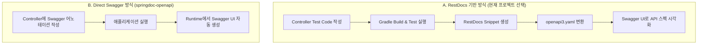

# Spring Boot API 문서화 방식 비교 분석: RestDocs vs Direct Swagger

Spring Boot 환경에서 API 문서를 자동화하는 두 가지 핵심 진영인 **RestDocs 기반 방식(RestDocs → OpenAPI3 → Swagger)**과 **Direct Swagger 방식(springdoc-openapi)**의 상세 비교 분석입니다.

---

## 🔄 워크플로우 비교



---

## 📊 종합 비교표

| 비교 항목 | RestDocs -> OpenAPI3 -> Swagger (선택 방식) | Direct Swagger (springdoc-openapi) |
| :--- | :--- | :--- |
| **테스트 코드 강제성** | **필수 (100% 강제)**<br>• 테스트가 성공해야만 문서가 빌드됨 | **선택 (비강제)**<br>• 테스트 없이 어노테이션만으로 문서 생성 |
| **메인 코드 오염도** | **없음 (Clean Code)**<br>• 비즈니스 코드에 문서화 어노테이션 미존재 | **높음 (Annotation Hell)**<br>• `@Schema`, `@Operation` 등으로 가독성 저해 |
| **문서 신뢰도** | **매우 높음 (100% 일치)**<br>• API 변경 시 테스트 실패로 즉시 감지 | **보통 (불일치 가능성 존재)**<br>• 로직만 바꾸고 어노테이션 수정 누락 가능 |
| **초기 설정 난이도** | **높음**<br>• Gradle 플러그인 및 테스트 인프라 설정 필요 | **매우 낮음**<br>• 의존성 추가만으로 즉시 동작 |
| **API 직접 테스트** | **지원 가능** (Swagger UI 연동으로 보완 완료) | **지원 가능** (기본 제공) |

---

## ⚖️ 장단점 분석

### 1. RestDocs → OpenAPI3 → Swagger (선택 방식)

#### 🟢 장점
- **프로덕션 코드의 순수성 유지**: `@RestController` 및 DTO가 비즈니스 로직과 데이터 검증(`@NotNull` 등)에만 집중할 수 있어 코드의 가독성이 극대화됩니다.
- **검증된 문서 신뢰성**: 테스트 코드가 완벽히 통과되어야 문서가 출력되므로 깨진 문서(Broken Documentation)가 배포되는 것을 구조적으로 차단합니다.
- **리팩토링 안정성**: API 응답 필드명을 변경하면 관련된 RestDocs 테스트가 바로 실패하므로, 개발자가 문서 수정을 잊어버리는 실수를 완벽히 방지합니다.

#### 🔴 단점
- **초기 설정 리소스**: Gradle 빌드 태스크 제어, OpenAPI Spec 변환 플러그인(`epages/restdocs-api-spec`) 등 인프라 설정에 비용이 듭니다.
- **테스트 작성 오버헤드**: 단순 조회 API 하나를 만들더라도 반드시 Controller 테스트 코드를 작성해야 문서화가 완료되므로 초기 속도가 무겁게 느껴질 수 있습니다.

---

### 2. Direct Swagger (springdoc-openapi)

#### 🟢 장점
- **압도적인 초기 개발 속도**: 어노테이션 추가 후 애플리케이션만 구동하면 바로 동작하므로, 프로토타이핑 및 빠른 MVP 출시에 최적화되어 있습니다.
- **간단한 학습**: 별도의 테스트 프레임워크 사용법을 숙지하지 않아도 코드 위에 직관적인 어노테이션만으로 설명 작성이 가능합니다.

#### 🔴 단점
- **Annotation Hell**:
  ```kotlin
  @Operation(summary = "카테고리 상세 조회", description = "ID로 카테고리 상세를 조회합니다.")
  @ApiResponses(value = [
      ApiResponse(responseCode = "201", description = "생성 성공", content = [Content(schema = Schema(implementation = CategoryResponse::class))]),
      ApiResponse(responseCode = "400", description = "잘못된 요청")
  ])
  @PostMapping
  fun createCategory(@RequestBody request: CategoryRequest): ResponseEntity<CategoryResponse> { ... }
  ```
- **문서의 거짓말 방치**: 비즈니스 로직 상 응답 스펙이 바뀌었지만 Swagger 어노테이션을 갱신하지 않아도 컴파일/빌드 시점에 에러가 발생하지 않아 실제 스펙과 다른 문서를 외부에 노출할 위험이 큽니다.

---

## 🎯 권장 방식 및 결론

현재 구축 중인 **`todo-app` 프로젝트**는 Kotlin Spring, NestJS, FastAPI 등 다양한 아키텍처를 학습하고 완성도 높게 관리하는 고품질 모던 애플리케이션 구조를 지향하고 있습니다. 

따라서 **Spring Kotlin 진영에서 가장 안전하고 모범적인 모범 사례(Best Practice)로 인정받는 `RestDocs -> OpenAPI3 -> Swagger` 방식을 도입하신 것은 매우 탁월한 아키텍처적 선택**입니다. 

- **NestJS/FastAPI**: 프레임워크 설계 철학(Decorator 및 Pydantic 기반 Type-First) 상 메인 코드 오염도가 낮고 자동화가 긴밀해 Direct Swagger가 유리합니다.
- **Spring Boot**: 프레임워크의 무겁고 견고한 특성상 메인 코드를 깔끔하게 격리하면서 **테스트 자동화와 신뢰성**을 최우선으로 확보할 수 있는 `RestDocs + OpenAPI3`가 가장 장기적으로 탄탄한 구조를 선사합니다.
